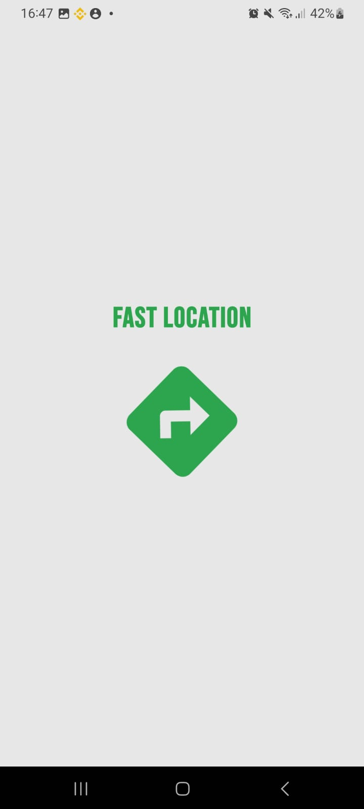
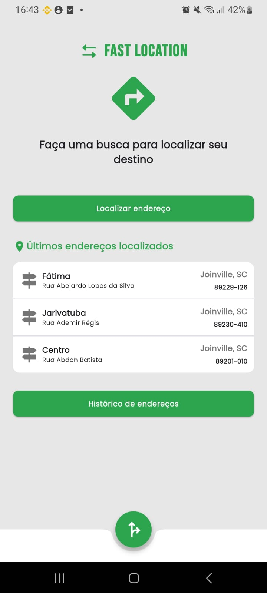
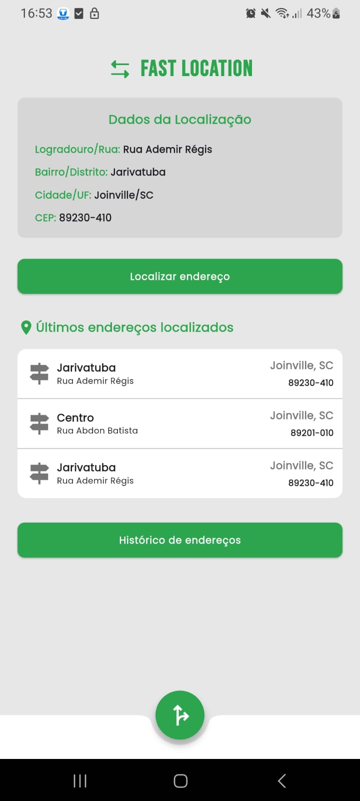
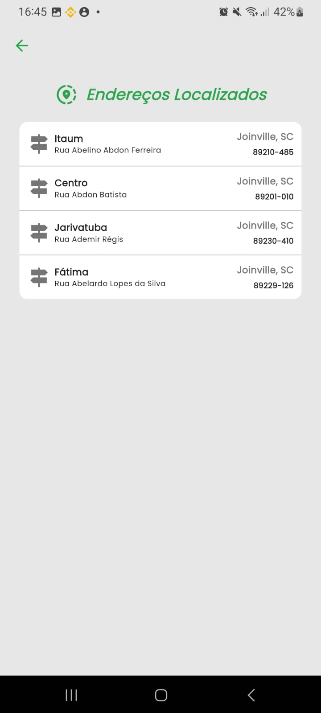
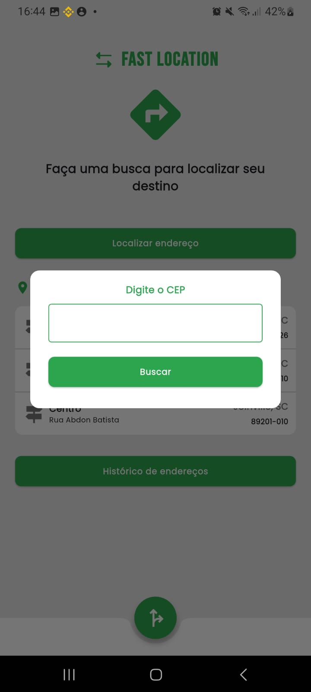

## FastLocation

> Aplicativo Flutter para consulta de endereços por CEP e localização geográfica com histórico e traçado de rota no mapa.

---

## 🚀 Visão Geral

O **FastLocation** é um aplicativo desenvolvido para a disciplina de Projeto Integrador com foco na empresa fictícia **FastDelivery**, que precisava otimizar a entrega de encomendas por meio da validação rápida de endereços.

O app permite:
- Consulta de endereço por CEP;
- Armazenamento local dos endereços buscados (histórico e recentes);
- Visualização do último endereço pesquisado;
- Abertura de rotas via GPS utilizando o Map Launcher.

---

## 👥 Desenvolvedor

**Cristian Moises Brunone Cordero**  \
Grupo 32

---

## 📷 Prints

| Splash | Home | Resultado da busca | Histórico |
|--------|------|---------------------|-----------|
|  |  |  |  |   |

---

## ⚖️ Tecnologias Utilizadas

- Flutter 3.x
- MobX para gerenciamento de estado
- Dio para requisições HTTP
- Hive para armazenamento local
- Map Launcher para rota GPS
- Geocoding para conversão de endereços
- Google Fonts e Flutter SVG

---

## ⚙️ Instalação e Execução

```bash
# Clone o repositório
git clone https://github.com/cristianbrunone/fast_location_cristian.git

cd fast_location

# Instale as dependências
flutter pub get

# Gere os arquivos do MobX
flutter pub run build_runner build --delete-conflicting-outputs

# Rode o app
flutter run
```

---

## 📁 Estrutura do Projeto

```bash
lib/
├── main.dart                      # Entrada principal do app
├── src/
│   ├── modules/
│   │   ├── home/
│   │   │   ├── controller/        # HomeController com MobX
│   │   │   ├── service/           # Lógica de negócio + API
│   │   │   ├── repositories/      # Hive (recentes e histórico)
│   │   │   ├── components/        # Widgets reutilizáveis
│   │   │   ├── model/             # AddressModel
│   │   │   └── page/              # HomePage
│   │   └── history/               # Tela de histórico com MobX
│   ├── shared/
│   │   ├── colors/                # Cores do app
│   │   ├── components/            # AppButton, AppLoading etc
│   │   ├── metrics/               # Constantes de espaçamento
│   │   └── storage/               # HiveConfig e enums de chaves
│   ├── routes/                    # Rotas nomeadas (AppRouter)
│   └── http/                      # Configuração do Dio
```

---

## 🔄 Funcionalidades principais

- [x] Splash screen com animação
- [x] Consulta de endereço via API do ViaCEP
- [x] Exibição do resultado com componente estilizado
- [x] Armazenamento de histórico e recentes via Hive
- [x] Navegação entre Home e Histórico
- [x] Integração com MapLauncher para rota GPS

---

## ✅ Status

Projeto **100% funcional e finalizado** conforme o enunciado da atividade.

---

## © Licença

Este projeto é de uso acadêmico para fins educacionais.
